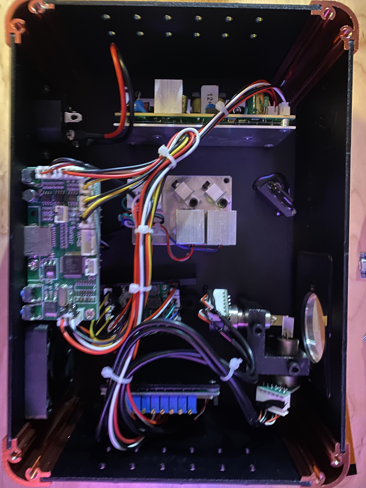
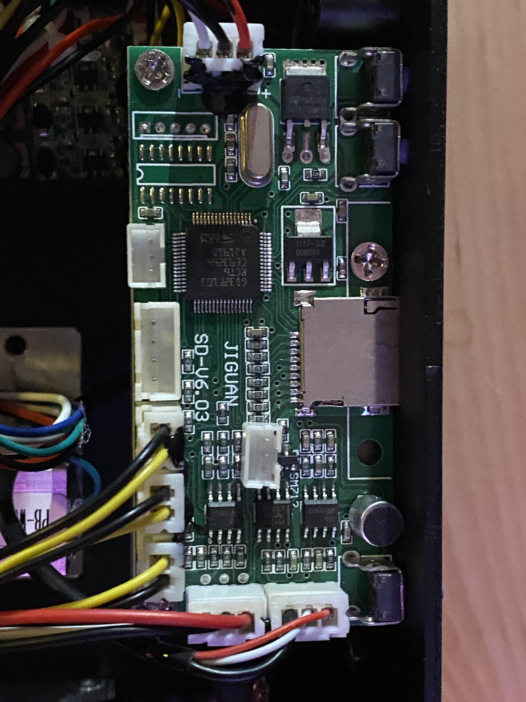
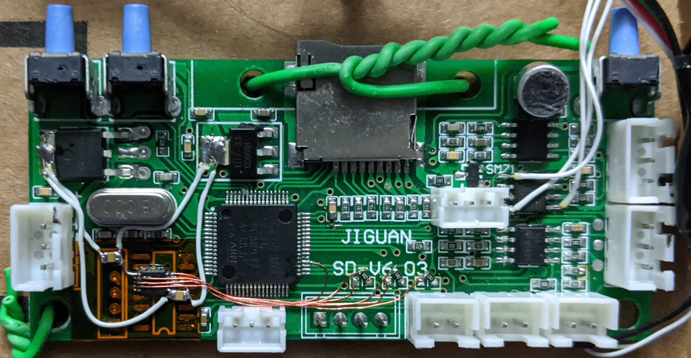

# Custom Firmware for SD-RGB500 Laser Projector

Quick-and-dirty hack to enable USB support for SD-RGB500 laser projector to allow realtime streaming over USB with [OpenLase](https://marcan.st/projects/openlase/).


**DISCLAIMER:** This information is provided 'as is' without warranty of any kind. Use it at your own risk. We can't be held accountable for broken devices or things went wrong.

## Getting Started

You will need to do some trace cutting and solder in a USB connector to use this firmware.

### Things that you will need
* STLINK or SWD adapter to re-program the controller board 
* 1.5K Ohm resistor - USB DP pull up
* USB connector / cable

## Build the firmware

ARM bare-metal toolchain is required to build the firmware. To build the firmware, simply run:

```
$ make
```

## Teardown




Thanks @zenofex for the teardown picture

## USB mod

To add the USB port, we need to add 1.5k pull up for USB DP and cut the trace between pin PA11 and the DMX transceiver since it is the only pin that can do USB

* Add 1.5k ohm resistor between pin PA12 and 3.3V.


* Solder USB DM, DP, and GND to USB cable.
* Cut the trace like in the picture below.


## Laser DAC mod

Laser driver in this projector support dimming but there are only two DAC channels in MCU. To use this dimming feature, external DAC is needed.

Currently TI DAC084S085/DAC124S085 is supported. To enable this feature, compile the firmware with `$ make LASER_DAC=1`



Rotate the 3 resistors to disconnect the output from GPIO pins, then connect the following pins:
* DAC SYNC pin -> MCU PB12
* DAC SCLK pin -> MCU PB13
* DAC DIN pin -> MCU PB15
* DAC VA and VREF to 3.3v (Note: add analog decoupling cap for these two)
* DAC VOUT{A,B,C} to the rotated resistors for RGB laser output.

Demo - https://www.youtube.com/watch?v=wXcMvL2OUvY

## Flashing the firmware

Make sure to disconnect power from the projector before flashing the firmware.

Attach STLINK / SWD adapter to the 5 pin ISP port and then do mass erase then program the custom firmware to flash. This can be done with `stlink-tools` or with `openocd`

## Demo

* Bad Apple - https://www.youtube.com/watch?v=cCVPGFpPB_s
* OpenLaser slides -  https://www.youtube.com/watch?v=ft7BrAy3mNU
